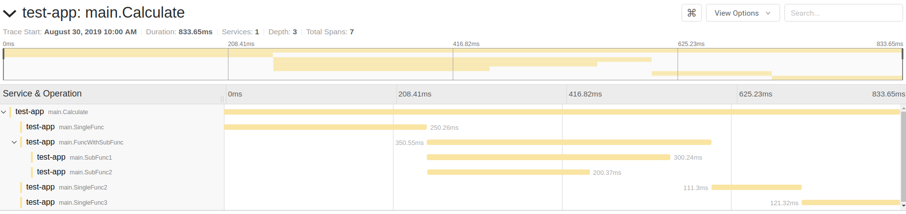

# Tracer


## Example

### Init tracer
```
func main() {
	err := tracer.Initialize(tracer.Config{
		ServiceName: "test-app",
		SamplerConfig: &jaegerConfig.SamplerConfig{
			Type:  "probabilistic",
			Param: 1,
		},
		ReporterConfig: &jaegerConfig.ReporterConfig{
			LogSpans:            true,
			BufferFlushInterval: 1 * time.Second,
			LocalAgentHostPort:  "localhost:6831",
		},
	})

	if err != nil {
		log.Fatal("Failed to init tracer")
	}
}

```

### Using tracer

```
// Calculate dummy calculate
func Calculate(ctx context.Context) {
	span, ctxParent := tracer.StartSpanFromContext(ctx)
	defer span.Finish()

	SingleFunc(ctxParent)
	FuncWithSubFunc(ctxParent)
}


// SingleFunc single function without sub func
func SingleFunc(ctx context.Context) {
	span, _ := tracer.StartSpanFromContext(ctx)
	defer span.Finish()

	time.Sleep(250 * time.Millisecond)
}

// FuncWithSubFunc function with sub function
func FuncWithSubFunc(ctx context.Context) {
	span, ctxParent := tracer.StartSpanFromContext(ctx)
	defer span.Finish()

	var wg sync.WaitGroup

	wg.Add(1)
	go func() {
		SubFunc1(ctxParent)
		wg.Done()
	}()

	wg.Add(1)
	go func() {
		SubFunc2(ctxParent)
		wg.Done()
	}()

	wg.Wait()
	time.Sleep(50 * time.Millisecond)
}

// SubFunc1 sub function
func SubFunc1(ctx context.Context) {
	span, _ := tracer.StartSpanFromContext(ctx)
	defer span.Finish()

	time.Sleep(300 * time.Millisecond)
}

// SubFunc2 sub function
func SubFunc2(ctx context.Context) {
	span, _ := tracer.StartSpanFromContext(ctx)
	defer span.Finish()

	time.Sleep(200 * time.Millisecond)
}
```

## Result
